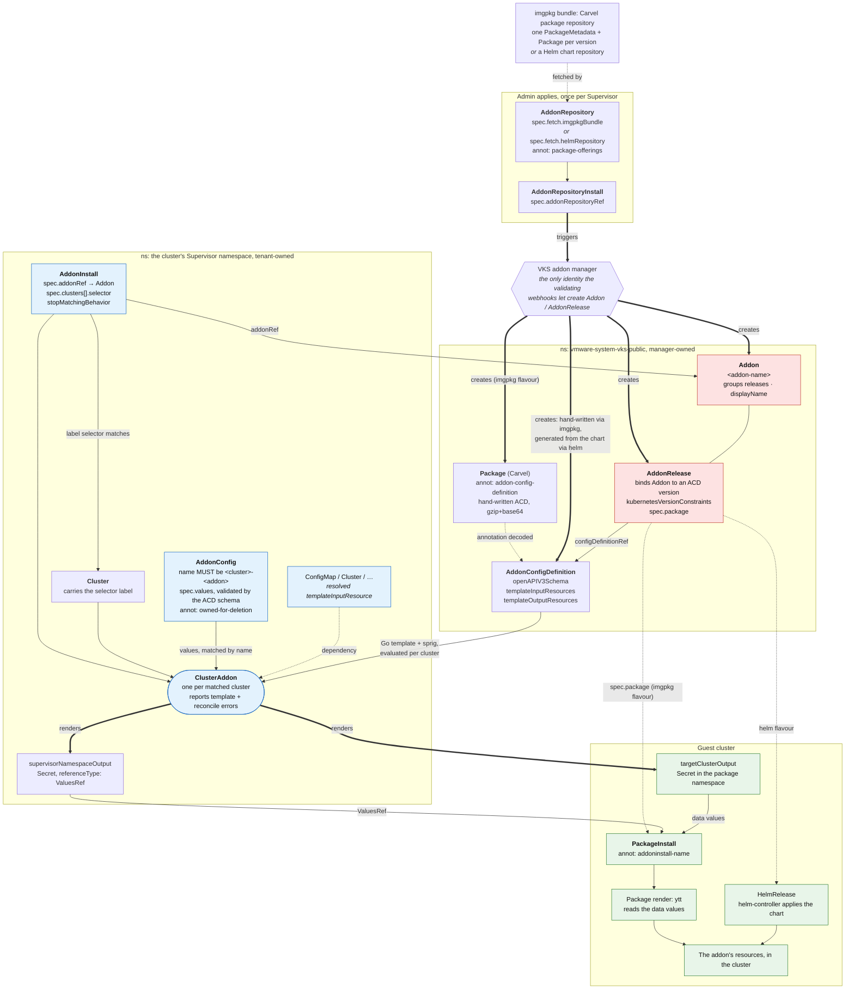

# Working with VKS addons

Hard-won, verified knowledge of the VKS addon system. Facts here were checked against a
live Supervisor and guest cluster (VKS 3.7). Where something is inferred rather than
tested, it says so. Trust shipped definitions over CRD field descriptions, which are
sometimes stale.

## The resource model

Eight kinds under `addons.kubernetes.vmware.com`, in three groups. Red is manager-owned
and webhook-locked, blue is tenant-created, green is inside the workload cluster.



Manager-owned, created for you, live in `vmware-system-vks-public`:

- **AddonConfigDefinition (ACD)**: the addon's contract. `openAPIV3Schema` is the
  tenant-facing values schema; `templateOutputResources` is what it renders per cluster;
  optional `templateInputResources` declares Supervisor objects to read (a `ConfigMap`,
  the `Cluster`); `spec.addonInstallPermission.accessPolicies` grants the rights for those
  reads and writes.
- **Addon**: groups releases of one addon. Mostly metadata (`displayName`, `description`).
- **AddonRelease**: binds an `Addon` to an `AddonConfigDefinition` version, carries
  `kubernetesVersionConstraints`, and may carry `spec.package`. If it has `spec.package`,
  the guest gets a PackageInstall; if not, the addon is package-free.

Admin- or tenant-creatable, the levers you actually pull:

- **AddonRepository** + **AddonRepositoryInstall**: an admin creates these; the manager
  reconciles them and materialises the three kinds above. This is the only way to get
  them created (see constraints).
- **AddonInstall**: a tenant attaches an addon to clusters via a label selector.
  References the `Addon` by `spec.addonRef`. Created in the cluster's Supervisor namespace.
  `stopMatchingBehavior` decides whether the addon's resources are removed or left behind
  when a cluster stops matching the selector.
- **AddonConfig**: per-cluster values, validated against the ACD schema. Must be named
  `<cluster-name>-<addon-name>` — that name is how the system pairs config to cluster — in
  the cluster's Supervisor namespace, with annotation
  `clusteraddon.addons.kubernetes.vmware.com/owned-for-deletion: "true"` so it is garbage
  collected with the ClusterAddon.

Created for you per matched cluster, and the thing to actually debug:

- **ClusterAddon**: one per cluster the `AddonInstall` selector matched. This is where the
  ACD's output templates evaluate, against that cluster's `AddonConfig`, so template errors
  surface in *its* conditions, per cluster, rather than anywhere upstream.

## The hard constraints (the expensive lessons)

**Addon and AddonRelease are manager-locked.** Validating webhooks
(`addon.validating.vmware.com`, `addonrelease.validating.vmware.com`) reject every
mutating operation on them from any client that is not the VKS addon manager's own
service account. RBAC does not help: a service account with `create` still gets denied at
admission, and create, update, client-side apply and server-side apply all fail
identically. The manager runs with `--enable-webhook-client-verification`; the check is on
caller identity. Errors look like:

```
Addon is a managed resource and CREATE is not allowed
operation on an AddonRelease is only allowed from VKS addon manager service account
```

**AddonConfigDefinition is NOT locked, but it is inert alone.** You can create an ACD
directly, but nothing consumes one that is not selected by an AddonRelease, and an
AddonInstall requires the Addon to reconcile ("The Addon must be created to reconcile the
AddonInstall"), with no field pointing at an ACD. So authoring only the ACD gets you
nothing.

*This is what blocks the package-free, fetch-free design*, which is otherwise the better
one and worth knowing about: a Supervisor Service lays down the ACD, the Addon, and an
AddonRelease carrying `addonConfigDefinitionRef` and **no `spec.package`**, with the last
`templateOutputResource` being a kapp-controller `App` with an `inline` fetch carrying the
payload. Tenants attach it with AddonInstall + AddonConfig exactly as normal. No Carvel
package, no guest image pull, no registry in the path at all. Every piece of it works
today except creating the Addon and AddonRelease.

It becomes viable if any of: the webhook is relaxed to admit RBAC-authorized callers; a
supported path appears for a non-manager principal to create a package-free Addon +
AddonRelease; or AddonInstall gains a direct ACD reference, removing the need for both.
Re-test with the token probe below — if a non-manager service account can create an
AddonRelease, the design is back on the table.

**The only route to create the three kinds is an AddonRepository.** Two flavours:

- `fetch.imgpkgBundle`: a Carvel package repository. The manager reads the Package(s) and
  creates the addon CRs. The AddonRelease gets `spec.package` set, so the guest gets a
  PackageInstall. This preserves a hand-written ACD (it travels in a Package annotation).
- `fetch.helmRepository`: the manager generates the ACD from the chart, with a fixed
  `helmValues`/`helmOptions` schema, and the AddonRelease is package-free. You lose control
  of the ACD schema and pull in `helm-controller` as a dependency. `spec.addonFilters`
  (helm only) narrows which charts and versions off the upstream index get reconciled —
  `[{name: external-secrets, versions: ["2.8.0"]}]` against `https://charts.external-secrets.io`.
  It selects; it does not exempt the repository from the `package-offerings` annotation.

| | `imgpkgBundle` | `helmRepository` |
|---|---|---|
| ACD | yours, shipped in the `Package` annotation as gzip+base64 | generated from the chart, fixed `helmValues`/`helmOptions` schema |
| Tenant API | whatever schema you write | helm values |
| Guest mechanism | `PackageInstall` -> ytt -> kapp | `HelmRelease` via helm-controller |
| `AddonRelease.spec.package` | set | not set |
| Dependencies | kapp-controller only | helm-controller must be installed |
| Version selection | the versions in the bundle | `spec.addonFilters` |

**An AddonRepository is frozen once an AddonRepositoryInstall references it.**
`addonrepositories.validating.vmware.com` permits only `spec.addonFilters` to be modified
after that, and `addonFilters` is a `helmRepository` field — so an **imgpkg
AddonRepository is immutable outright**, `spec.fetch.imgpkgBundle.imageURL` included.
Verified: a server-side dry run changing only `imageURL` was rejected with

```
AddonRepository is in use by an AddonRepositoryInstall
```

The rejection is on the **update operation, not on the change**: a patch re-applying the
annotation's *existing, identical* value is refused just the same. `kubectl apply` of an
unchanged manifest is a client-side no-op and never reaches admission, so re-applying is
safe; anything that computes a real diff is not.

Deletion is *not* blocked; only update is. So there is no way to repoint an existing
registration at a new bundle. Superseding a repository means creating a **new
repo+install pair** with a distinct name **and** a distinct `spec.targetRepositoryName`,
moving consumers onto it, then deleting the old pair. This is what ships: VKS keeps
`standard-packages` 3.6 registered alongside `vks-addons-3.7.0`.

`spec.targetRepositoryName` names the backing Carvel `PackageRepository`. Two different
catalogs must not share one; reuse it only for mirrors of the same catalog. Object names
cannot contain a dot, so a version-suffixed name needs dashes
(`dayzero-addon-repo-1-1-0` for catalog `1.1.0`).

**But the image under a registration is not frozen — the tag is re-resolved.** The backing
`PackageRepository` stores the *tag*, not the digest, and re-fetches on its own. Verified:
a bundle pushed to an already-registered tag was picked up **569s** later (no explicit
`syncPeriod`), and the manager materialised an `AddonRelease` *and* an ACD for the package
version the new bundle added, with no CR touched. Combined with `package-offerings` being
unenforced, that gives the **rolling catalog** pattern:

- register **one permanent pair** whose `imageURL` is a floating tag (`:stable`), whose
  names carry no version, and whose offerings annotation names the package with
  `"versions": []`;
- publish each new package version to the bundle behind that tag (plus an immutable
  snapshot tag for provenance);
- every registered repository picks it up within ~10 minutes, with no admin action and no
  new CRs, forever.

The cost is that the registration no longer identifies what it serves, so keep the catalog
**append-only** — freeze each published package's YAML — or a moved tag can silently
redefine a version consumers are pinned to. `warroyo/dayzero-addon-service` implements
this end to end.

Practical consequence for a Supervisor Service wrapper: either make the CRs
release-independent as above, so an upgrade re-applies them unchanged and kapp skips them,
or give them version-suffixed names so an upgrade *replaces* the pair (kapp delete +
create, both allowed). What you cannot do is let a version-bearing field change under a
constant name — that is the update the webhook rejects.

**The guest fetch is unavoidable with imgpkg.** `spec.package` forces a guest
PackageInstall, and the guest acquires the package through a repository that fetches a
bundle. There is no package-free-and-fetch-free path through the addon system. Guest pulls
route through an in-cluster proxy (`mgmt-image-proxy.kube-system.svc` / the depot) that the
Supervisor feeds, not straight to an external registry.

**Supervisor Service packages get their namespace rewritten.** A Supervisor Service is
deployed with kapp's namespace rewrite, so every namespaced resource it applies lands in
the service's own namespace (`svc-<name>-<id>`), not where the YAML says. Cluster-scoped
resources are exempt. The manager does reconcile an AddonRepository/AddonRepositoryInstall
created in a service namespace, so a thin Supervisor Service wrapping those two CRs works.

**Placement and required labels/annotations.**
- The three addon kinds must be in `vmware-system-vks-public`.
- Each must carry `addon.kubernetes.vmware.com/addon-name` = the addon name (webhook
  rejects without it). Shipped addons also carry `addon.kubernetes.vmware.com/addon-namespace`.
- An AddonRepository must carry `addons.kubernetes.vmware.com/package-offerings` (a JSON
  listing of packages/versions it offers) or the webhook rejects it. It is **declarative,
  not enforced**: the manager materialises whatever the bundle actually contains and never
  checks it against the annotation. Verified — a repository whose annotation listed one
  package version, pointed at a bundle carrying two, reconciled `Ready=True` with no error
  and materialised an AddonRelease *and* an ACD for **both**, including the version the
  annotation omitted. So treat it as advertising copy (it is what the shipped repos'
  catalog listings are built from), not as a gate. Every shipped repository does keep it
  exact — the builtin lists all 22 of its packages with no version mismatches — and it is
  frozen after install, so a stale one cannot be corrected in place. Generate it from the
  same list that assembles the bundle. Shape:
  ```json
  {"repositoryVersion":"1.1.0",
   "packages":{"dayzero.kubernetes.vmware.com":{"versions":["1.0.1","1.0.2"]}}}
  ```
  Required for **both** fetch flavours — the check is on the kind, not on `spec.fetch`.
  Verified: a server dry run of an `imgpkgBundle` repository and of a `helmRepository`
  one, annotation omitted, are rejected identically with
  ```
  The AddonRepository "<name>" is invalid:
    metadata.annotations.addons.kubernetes.vmware.com/package-offerings: Not found
  ```
  On a helm repository `addonFilters` does **not** stand in for it; live helm-based repos
  carry both, with the annotation restating the filter
  (`{"repositoryVersion":"1.0.0","packages":{"external-secrets":{"versions":["2.8.0"]}}}`
  next to `addonFilters: [{name: external-secrets, versions: ["2.8.0"]}]`). For a helm
  repository the offerings keys are chart names, not Carvel package refs.

## What package-offerings gates: the AddonRepositoryInstall validator

Unenforced against bundle contents at reconcile time (above) does not mean unenforced,
full stop. A separate validating-webhook layer on AddonRepositoryInstall reads
`package-offerings` actively at create/update/delete. Sourced from the validator's
functions, not independently live-tested here the way the rest of this file is — treat the
call sites as documented, not measured:

- **Duplicate detection on create** (`validateNoDuplicateStdPackageARI` /
  `FindExistingStdPackageARI`). If the target AddonRepository lacks the internal
  `pkgr-type=vks-addons` label, the validator falls back to comparing `package-offerings`
  (via `EqualPackageOfferings` — structural equality, key/array order ignored) against every
  other installed repo. A match blocks creation as a duplicate. This is the hook a
  third-party repository gets without the internal label: declare the same `packages`
  content as an existing repo and you are recognized as equivalent, same as if it were a
  VKS-owned one.
- **Version-compatibility on update** (`validateStdPackageSameVersion`). Repointing an ARI's
  `addonRepositoryRef` at a different AddonRepository diffs old vs. new
  `package-offerings`; content that doesn't match rejects the update. Either side omitting
  the annotation skips the check — the same graceful degradation as reconciliation.
- **Conflict with Helm-based Addons** (`validateHelmAddonConflict`). Package names in the
  annotation are parsed with `ExtractPackagePrefix` (substring before the first `.`) into
  addon names and checked against existing Helm-based `Addon` resources in the namespace —
  blocks installing a Carvel package that would collide by name with an already-installed
  Helm addon.
- **Removal-in-use protection on update** (`validatePackagesMetadataDiff` / `DiffRemoved` ->
  `validateRemovedPackagesNotInUse`). Diffs old vs. new annotation for package/version combos
  that were dropped. For anything dropped and not listed under `removedExceptionPackages` /
  `removedExceptionVersions`, checks whether a live `ClusterAddon` still references the
  AddonRelease named `<package>.<version>` (`+` swapped for `-`) and blocks the update if so.
- **Deletion protection** (`validateNoPackageInUseForARIDelete`). The same in-use check runs
  at ARI delete time, against every package/version the annotation lists.

Takeaway for a third-party AddonRepository author: these checks are what you buy by keeping
the annotation accurate, not the manager's reconcile behavior.

- List every installable package under `packages.<name>.versions`, named to match the
  `<name>.<version>` (`+` -> `-`) AddonRelease convention — that's the identity the in-use
  checks key on.
- A version you stop serving must either stay served or move to
  `removedExceptionPackages` / `removedExceptionVersions` — otherwise your *own* next update
  is the one the webhook blocks.
- A structurally identical `packages` block in another repository *will* collide with you on
  create/update. That's the intended duplicate-detection behavior, not a bug to route
  around — pick a `packages` shape only you serve if you don't want to be treated as a mirror
  of someone else's catalog.
- The individual checks above degrade gracefully if an annotation is missing on either side
  (e.g. the update/delete comparisons just skip), which reads as defensive coding against
  objects from before the annotation was required — it does not mean you can skip the
  annotation now. The AddonRepository-create check (above: "Not found" on either fetch
  flavour) already forces it on every new object, and skipping the check is exactly the
  scenario that loses duplicate detection and update/delete in-use protection, so the
  practical guidance is the same: keep it, and keep it accurate.

## Delivery: the ACD-in-annotation and payload-as-data patterns

**A hand-written ACD ships inside a Package.** Put the full AddonConfigDefinition YAML into
the Package's `addons.kubernetes.vmware.com/addon-config-definition` annotation as
**gzip+base64**. The manager decodes it and creates the ACD. This is how cilium and every
package-derived addon delivers its definition, and it is how you keep your own schema
through the AddonRepository route. Encode with `gzip -c | base64 -w0`.

**Per-cluster payload flows as data through a values Secret.** The standard pattern (see
cilium):

1. Tenant writes values in `AddonConfig.spec.values`.
2. The ACD's `templateOutputResources` render a **Secret** carrying those as data values.
   Use a `supervisorNamespaceOutput` Secret with `referenceType: ValuesRef` (wired into the
   guest PackageInstall's values) plus a `targetClusterOutput` Secret of the same name in
   the guest package namespace (`vmware-system-tkg`). Body shape:
   `stringData: {values.yaml: |\n  <data values>}` and `type: Opaque`.
3. The Package's own render (ytt, in the guest) reads those values and emits resources.

To pass arbitrary YAML through ytt data values safely (ytt interprets `#@`): JSON-encode
it in the ACD and decode in the package. E.g. structured resources as
`{{ .Values.resources | toJson | toJson }}` -> a JSON string; the package does
`json.decode`. Raw multi-doc YAML as `{{ $raw | toJson }}`; the package splits on the doc
separator and `yaml.decode`s each.

**`addonInstallPermission` is Supervisor-side only.** `spec.addonInstallPermission.
accessPolicies` on the ACD grants the addon controller rights *in the cluster's Supervisor
namespace* — reading `templateInputResources` and writing the output Secret — and says
nothing about the guest. Declare what your outputs and inputs actually touch; the shipped
cilium ACD declares `get`/`list`/`watch` on configmaps plus full access to secrets, which
is the usual shape.

In the guest, the payload is applied by the `PackageInstall` identity the addon system
owns, which is privileged enough to install cluster addons. An addon author does not get
to choose that identity or scope it down — if a configurable ClusterRole matters, the
addon system is the wrong delivery mechanism for that payload.

## Output templates are the resource body only

Verbatim from the CRD: a `template` is the resource specification excluding TypeMeta and
ObjectMeta. Consequences:
- No `apiVersion`, `kind`, or `metadata` in a template.
- One resource per output entry; no multi-document output.
- The GVK is a static literal on `targetClusterOutput`/`supervisorNamespaceOutput`. `name`
  and `namespace` are templatable, the GVK is not. This is why an addon cannot emit
  arbitrary payload kinds directly; render them in a package instead.

## The template dialect

`templateOutputResources[].template` is **Go `text/template` + sprig**, evaluated per
cluster by the addon controller (not CEL, despite a stale CRD field description). Plus the
Helm-style `toYaml`/`fromYaml`, which the controller registers although they are not sprig.
Context roots:

- `.Values.<field>` (capital V): the AddonConfig values, defaulted from the ACD schema.
- `.Dependencies.<inputName>`: a resolved `templateInputResource` (the whole object).
- `.Cluster` (e.g. `.Cluster.name`) and `.Addon`.

The Package's own guest-side render is **ytt** (`json`, `yaml`, `data` modules useful).

## Building an imgpkg addon-repository bundle

A Carvel package repository bundle:

```
.imgpkg/images.yml            # ImagesLock; generated by kbld, empty if config-only
packages/<pkg-ref>/
  metadata.yml                # PackageMetadata
  <version>.yml               # Package, with the ACD in its annotation
  <version>.yml               # ...one per version. It is a catalog, not one package.
```

The Package's `spec.template.spec` is `fetch` (use `inline` to avoid a second guest fetch
for the package content) / `template` (ytt) / `deploy` (kapp). An admin then applies an
AddonRepository pointing at the pushed image, plus an AddonRepositoryInstall.

### A repository is a catalog: keep its version separate from package versions

The single most expensive mistake is treating a repository as a shipping container for
the current version and tagging the bundle with the package version. The builtin repo
shows the intended shape: `vks-addons:3.7.0-20260618` carries **22 packages**, several at
multiple versions (`cluster-autoscaler` at 4, `cert-manager` at 2), under a
`repositoryVersion` of `3.7.0+20260618` — an identity unrelated to any package version.

So drive a build from two independent inputs:

- a **repository version** — the imgpkg tag, `spec.version`, and `repositoryVersion`,
  bumped when the catalog changes;
- a **list of package versions** the bundle assembles, which also generates
  `package-offerings`.

The payoff is directly downstream of the immutability constraint above. Because every
version in the catalog gets its own `AddonRelease` materialised, a consumer changing which
version a cluster runs only moves a `releaseFilter` pin — no Supervisor-admin access, no
new resources — and older versions stay live as rollback targets. Shipping one package
version per repository forces a hand-registered repo+install pair for *every* version
bump.

#### Two ways to carry a catalog forward, and how VKS itself does it

**Per-release catalogs (what VKS ships).** Each catalog is a dated snapshot behind an
immutable tag, and superseded catalogs *stay registered*. Verified on a live Supervisor,
`3.6.0+20260211` and `3.7.0+20260618` both registered, with a rolling window of roughly
1–5 versions per package inside each and **no version overlap between them**:

| package | in the 3.6 catalog | in the 3.7 catalog |
|---|---|---|
| cert-manager | 1.18.2, 1.18.3, 1.19.1, 1.19.2 | 1.19.4, 1.20.2 |
| istio | 1.27.1, 1.27.4, 1.27.5, 1.28.2 | 1.28.7, 1.30.0 |
| velero | 1.16.2 ×2, 1.17.0, 1.17.1, 1.17.2 | 1.17.2, 1.18.1 |

So the window rolls *per catalog*, and continuity comes from keeping the old registration:
a cluster pinned to cert-manager 1.18.2 is served by the 3.6 pair, which nobody has
deleted. Deprecation is never "drop a version from a live catalog" — it is "publish a
narrower new catalog, then delete the old registration once nothing is pinned to it". Cost:
an admin registers a pair per catalog release. Right for a catalog that ships with the
platform on a release train.

**One rolling registration (see [the floating tag](#the-hard-constraints-the-expensive-lessons) above).**
One permanent pair on a floating tag; publishing re-points the tag and the manager
re-resolves it. Cost: nothing per release, but the registration no longer identifies what
it serves. Right for a catalog that gains a package version every week.

Whichever you pick, **do not remove a version from a catalog that is already registered**.
Under the rolling model the removal reaches clusters by itself, and any cluster pinned to
that version loses the `AddonRelease` and ACD under it. Keep the catalog append-only, or
deprecate the VKS way, with a second registration and a deliberate deletion. (What the
manager does to an in-use `ClusterAddon` when its `AddonRelease` vanishes is untested here
— which is itself a reason not to find out in production.)

Two registrations *may* share a `targetRepositoryName` when they are mirrors of one
catalog: VKS does exactly this, with `builtin-addonrepository-3.7.0` and
`builtin-addonrepository-3.7.0-depot.kube-system.svc` both backing
`vks-addons-3.7.0-20260618`, the second pointing at the in-cluster depot.

### Freeze released package YAML; never re-render it

The ACD is embedded **inside** each Package (gzip+base64 in the annotation), so a Package
is not a pointer to a definition — it *is* the definition. Re-rendering version 1.0.1 from
today's templates produces a file still called 1.0.1 that means something else, and every
consumer pinned to it gets the change silently on the next catalog release.

Commit the rendered YAML per version and have the build copy it into the bundle,
generating only versions that have no committed file yet. Encode with `gzip -n -c |
base64 -w0`: without `-n`, gzip stores an mtime and the same input encodes differently on
every run, so you cannot tell a real change from a rebuild.

### Use kctrl's authoring commands, and pick the right one

Two different artifacts, two different kctrl flows. Do not conflate them.

**A package repository** — `kctrl package repository release`. Point it at a directory
holding `pkgrepo-build.yml` (kind `PackageRepositoryBuild`, `spec.export.imgpkgBundle.image`)
and the `packages/<pkg-ref>/` tree above:

```sh
kctrl package repository release -y --chdir <dir> -v <repo-version> -t <repo-version>
```

It shells out to `kbld -f packages --imgpkg-lock-output .imgpkg/images.yml` and then
`imgpkg push`, so the ImagesLock is generated rather than hand-written — for config-only
packages kbld emits an ImagesLock with the `images` key absent, not `images: []`. **`-t` is
not optional in practice**: the default tag is `build-<TIMESTAMP>`, and that tag is exactly
what the AddonRepository's `imageURL` has to name. kctrl also drops a Carvel
`PackageRepository` CR into the working directory; VKS does not use it (it uses
AddonRepository) and it is not included in the pushed bundle. Verified: repeated runs over
identical inputs push an identical digest.

**A single package** — `kctrl package release`, from a directory with the standard
`package-build.yml` / `package-resources.yml` pair. It writes
`carvel-artifacts/packages/<ref>/{package.yml,metadata.yml}`. This is what a **Supervisor
Service wrapper** needs: what gets uploaded to the vCenter Services catalog is a package
*reference* — a `Package` plus its `PackageMetadata` — **not** a package repository. Pass
`-t <version>` here too, or the wrapper bundle lands under a timestamp tag.

Do **not** reach for `kctrl package release --repo-output` to produce the
`packages/<ref>/<version>.yml` files for an addon repository, even though that is its
documented purpose. It builds an imgpkg bundle for the package *contents*, which is the
extra guest-side fetch an inline-fetch addon exists to avoid, and it gives you no place to
put a hand-authored ACD annotation. Render those Packages with ytt and let kctrl handle
only the repository around them.

## Live verification probes

You can learn a lot without a full build/upload cycle.

- **Test the webhook lock** without publishing anything: mint a token for a service account
  that has RBAC on the kind, and attempt the create.
  ```sh
  kubectl -n <ns> create token <sa> --duration=10m   # build a kubeconfig with it
  # then, as that token, kubectl create the Addon/AddonRelease -> observe admission denial
  ```
  If it succeeds, the webhook policy has been relaxed.
- **Confirm an AddonRepository is frozen** before planning an upgrade path around it, with
  a server-side dry run that changes one field and applies nothing:
  ```sh
  kubectl -n vmware-system-vks-public patch addonrepository <name> --type=merge \
    --dry-run=server -p '{"spec":{"fetch":{"imgpkgBundle":{"imageURL":"ghcr.io/x/y:z"}}}}'
  ```
  A rejection naming the AddonRepositoryInstall means the freeze is in force.
- **Ask whether a field or annotation is really required** with a server dry run of a
  throwaway resource — nothing is persisted, and the rejection names the offending field:
  ```sh
  kubectl apply --dry-run=server -f probe.yml
  ```
  Do this rather than reading the webhook config: cluster-scope reads of
  `validatingwebhookconfigurations` are forbidden even to `sso:Administrator@<domain>` on
  a stock Supervisor, so the dry run is usually the only view of the rule you can get.
- **Survey how the registered repositories are actually built** — which fetch flavours are
  in play, and which fields travel together:
  ```sh
  kubectl -n vmware-system-vks-public get addonrepository -o json | jq -r '.items[]
    | {name: .metadata.name, fetch: (.spec.fetch | keys),
       offerings: (.metadata.annotations["addons.kubernetes.vmware.com/package-offerings"] != null),
       addonFilters: .spec.addonFilters}'
  ```
- **Read a shipped repository's catalog shape** — the best available spec for how big and
  how versioned a repository is meant to be:
  ```sh
  kubectl -n vmware-system-vks-public get addonrepository -o json | jq -r '
    .items[] | .metadata.name, (.metadata.annotations["addons.kubernetes.vmware.com/package-offerings"]
    | fromjson | {repositoryVersion, packages: (.packages | map_values(.versions))})'
  ```
- **Reach a guest cluster** from the Supervisor: pull its kubeconfig.
  ```sh
  kubectl -n <cluster-ns> get secret <cluster>-kubeconfig -o jsonpath='{.data.value}' | base64 -d > guest.kubeconfig
  ```
- **Decode a shipped ACD** to use as a reference implementation:
  ```sh
  kubectl -n vmware-system-vks-public get package <pkg> \
    -o jsonpath='{.metadata.annotations.addons\.kubernetes\.vmware\.com/addon-config-definition}' \
    | base64 -d | gunzip
  ```
- **Test the guest render** directly: create an inline-fetch kapp-controller `App`, or a
  `Package` + `PackageInstall` with inline content and a values Secret, in a scratch guest
  namespace. Confirms the ytt render and that inline fetch pulls no image. kapp-controller
  is in `tkg-system`; carvel CRDs and guest PackageRepositories are present.
- **Read reconcile errors**: `AddonRepositoryInstall`, `PackageInstall` and `ClusterAddon`
  all expose `status.usefulErrorMessage` / conditions. The addon controller reports template
  errors in the ClusterAddon conditions, per cluster, after install.
- **Check who reconciles what**: an AddonInstall creates a guest PackageInstall (annotation
  `addons.kubernetes.vmware.com/addoninstall-name`). Guest Package CRs carry
  `packaging.carvel.dev/package-repository-ref` if fetched by a repo, or none if manager-synced.

## Decision guide

- Want your own tenant-facing schema and to run on kapp-controller only: **imgpkg
  AddonRepository** with the ACD in the Package annotation. Accept the guest package fetch.
- Fine with a helm-values interface and want a package-free AddonRelease: **helm
  AddonRepository**. Accept the generated ACD and helm-controller dependency. Pick charts
  and versions with `spec.addonFilters`, and still write the matching `package-offerings`
  annotation — it is required of every AddonRepository, whatever the fetch.
- Want single-upload delivery through the vCenter Services catalog: wrap the two
  AddonRepository CRs in a **Supervisor Service** (they land in the service namespace; the
  manager still reconciles them). Build it with `kctrl package release` — it is a package
  reference, not a repository. Otherwise just `kubectl apply` the two CRs.
- Deciding what a release tag means: make it the **repository/catalog version**, and take
  package versions from a list in the build. One version driving both is the mistake that
  forces consumers to hand-register a repo+install pair per package bump.
- Planning how consumers move between addon versions: ship every released version in one
  catalog and let them move a `releaseFilter` pin. Reserve a new repo+install pair for a
  new *catalog*, and delete the superseded pair once pins have moved.
- Deprecating old package versions: **not by removing them from a registered catalog**.
  Either stay append-only, or do it the VKS way — a narrower new catalog registered
  alongside the old one, old pair deleted only once nothing is pinned to it.
- Publishing package versions often, and unwilling to make an admin act each time: point
  the registration at a **floating tag** and keep everything in the CR
  release-independent. The manager re-resolves the tag (~10 min) and materialises what it
  finds. Keep the catalog append-only so a moved tag never redefines a published version.
- Tempted to update a registered AddonRepository (new `imageURL`, corrected
  `package-offerings`): **you cannot**. Ship a new pair with a new name and
  `targetRepositoryName`, then delete the old one — or avoid needing to, per the previous
  bullet.
- Tempted to create the Addon/AddonRelease yourself (Job, controller, apply): **do not**,
  it is webhook-blocked by caller identity. Only the manager can, only via AddonRepository.

## Reference implementation

`warroyo/dayzero-addon-service` is a worked example: a generic "apply arbitrary YAML at
provisioning" addon built as an imgpkg AddonRepository with a hand-written ACD and a native
render package, plus a Supervisor Service wrapper and both install methods. Its
`docs/design.md` records the package-free design (see *Package-free addons are legal* and
*Alternatives rejected*), and `docs/verify.md` records the probes it was checked with.

It also implements the catalog pattern above end to end: `REPO_VERSION` and `PKG_VERSIONS`
as independent build inputs, frozen per-version Package YAML under `released/`,
`package-offerings` generated from the version list with a `make check` that compares it
against the assembled bundle, version-suffixed AddonRepository names, and both kctrl
release flows. `docs/plan.md` has the build mechanics.
